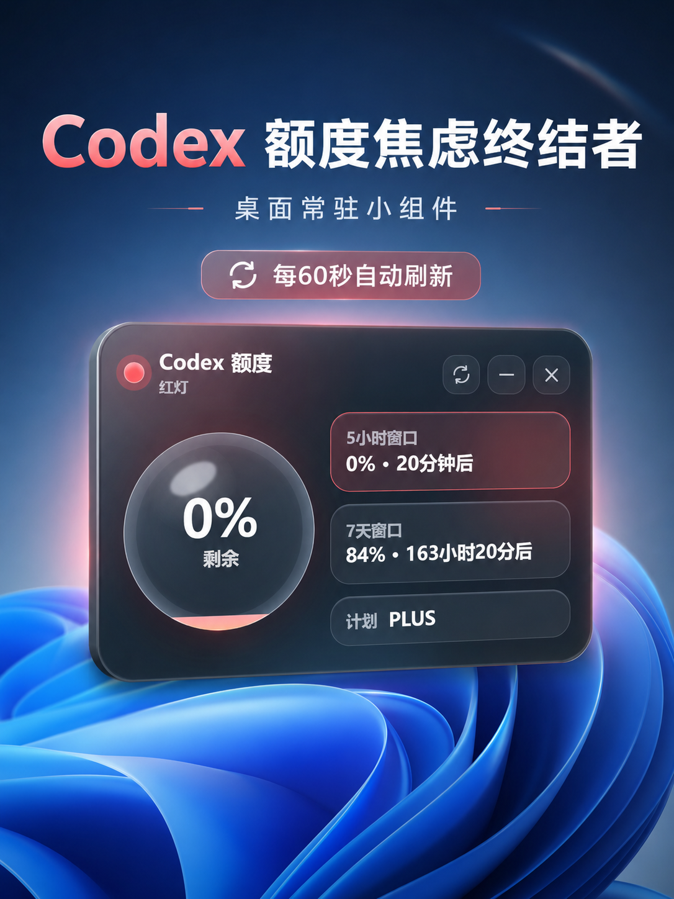
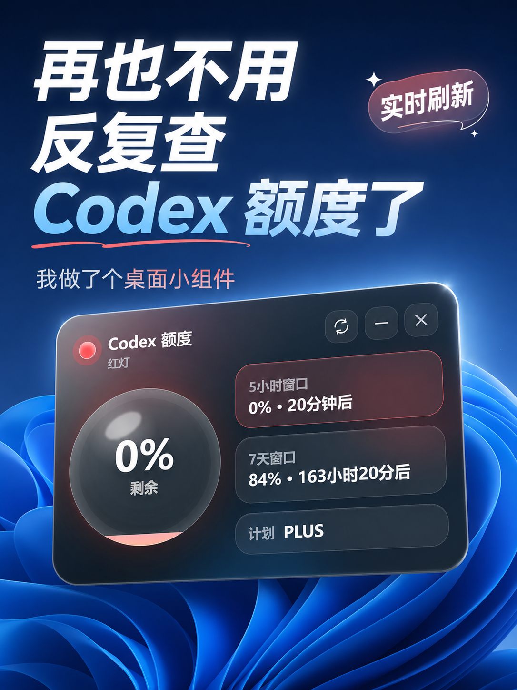
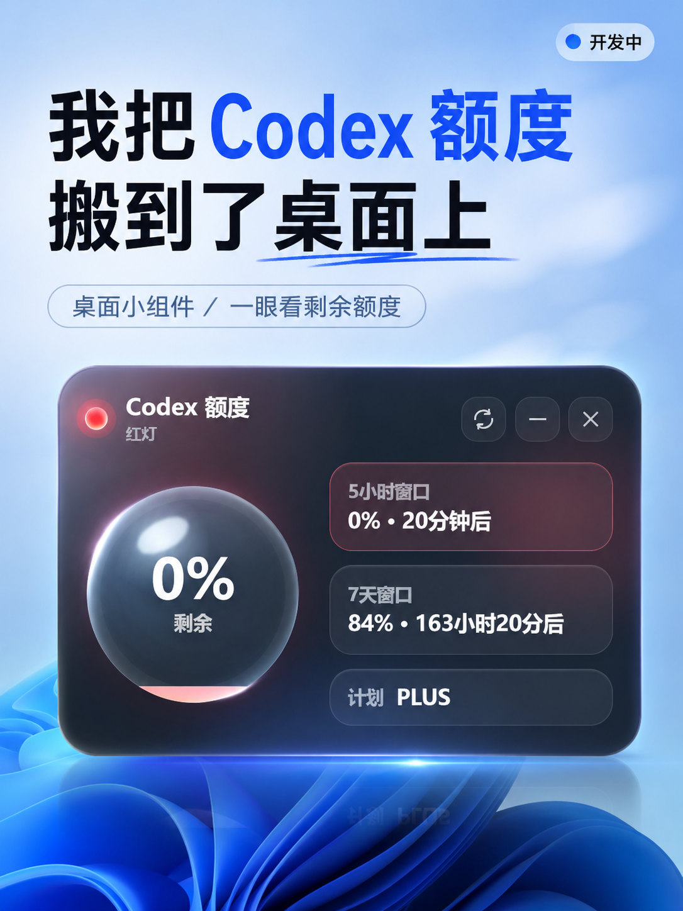

# Codex LED Widget

<p align="center">
  
</p>

<p align="center">
  <strong>A tiny liquid-glass Windows desktop widget for monitoring your local Codex usage quota.</strong>
</p>

<p align="center">
  <strong>一个用于查看本机 Codex 剩余额度的 Windows 桌面悬浮小组件。</strong>
</p>

<p align="center">
  <a href="#中文说明">中文</a> ·
  <a href="#english">English</a> ·
  <a href="https://github.com/xicunwus2025-sys/codex-led-widget/releases">Download</a>
</p>

---

# 中文说明

Codex LED Widget 是一个 Windows 桌面悬浮小组件，用于显示本机 Codex 剩余额度。

它采用透明液态玻璃质感界面，通过红、黄、绿三种 LED 状态，让你不用频繁打开命令行或页面，也能快速知道 Codex 额度是否快用完。

---

## ✨ 功能特点

- 🟢 **红绿灯额度状态**
  - 绿色：剩余额度大于等于 10%
  - 黄色：剩余额度小于 10%，但仍大于 0
  - 红色：剩余额度为 0

- 🪟 **液态玻璃悬浮窗口**
  - 透明桌面小组件
  - 简洁、高颜值
  - 不遮挡正常开发工作

- 📌 **支持置顶**
  - 可以让小组件始终显示在其他窗口上方
  - 不需要时也可以取消置顶

- 🌐 **支持中文 / English 切换**
  - 内置双语界面
  - 中英文用户都可以使用

- 🔄 **自动刷新额度**
  - 自动读取 Codex 使用情况
  - 到额度重置时间后会再次刷新

- 🔐 **隐私友好**
  - 使用本机已有的 Codex 登录状态
  - 不读取、不保存、不上传、不显示认证 Token

---

## 📸 截图预览

<p align="center">
  
  
  
</p>

<p align="center">
  
  
</p>

---

## 🚀 下载

请前往 **Releases** 页面下载最新版 Windows `.exe` 文件：

👉 [前往 Releases 下载](https://github.com/xicunwus2025-sys/codex-led-widget/releases)

当前版本：`v0.1.0`

---

## 🖥️ 运行要求

- Windows 10 / Windows 11
- 电脑上已经安装 Codex
- 本机 Codex 已经登录

---

## 📦 使用方法

1. 打开 [Releases](https://github.com/xicunwus2025-sys/codex-led-widget/releases) 页面。
2. 下载最新版本的 `.exe` 文件。
3. 确保电脑上已经安装并登录 Codex。
4. 双击运行 `.exe`。
5. 如果 Windows 提示未知发布者：
   - 点击 **更多信息**
   - 点击 **仍要运行**

---

## 🔴 额度颜色说明

| 颜色 | 含义 |
|---|---|
| 🟢 绿色 | 剩余额度大于等于 10% |
| 🟡 黄色 | 剩余额度小于 10%，但大于 0 |
| 🔴 红色 | 剩余额度为 0 |

额度状态会根据本机可读取到的 Codex 使用数据进行计算。

---

## 🔐 隐私说明

Codex LED Widget 设计目标是本地化、轻量、隐私友好。

- 使用本机已有的 Codex 登录状态
- 不需要你手动输入 Token
- 不读取你的认证 Token
- 不保存你的认证 Token
- 不上传你的额度数据
- 只显示 Codex 额度相关状态
- 数据保留在你的电脑本地

---

## 🛠️ 本地开发

克隆仓库：

```bash
git clone https://github.com/xicunwus2025-sys/codex-led-widget.git
cd codex-led-widget
````

安装依赖：

```bash
npm install
```

开发模式运行：

```bash
npm run dev
```

启动应用：

```bash
npm start
```

打包 Windows 便携版：

```bash
npm run build
```

打包完成后，生成文件会出现在 `dist` 文件夹中。

---

## 📁 项目结构

```txt
codex-led-widget/
├─ assets/          # 截图和图片资源
├─ src/             # Electron 应用源码
├─ package.json     # 项目配置和打包脚本
└─ README.md
```

---

## ❓ 常见问题

### 这个工具支持 macOS 或 Linux 吗？

目前主要面向 Windows 使用。如你需要可以联系我定制

### 我需要手动输入 Codex Token 吗？

不需要。
小组件会使用你本机已有的 Codex 登录状态，不需要你手动输入 Token。

### 为什么 Windows 会提示未知发布者？

因为当前应用还没有进行代码签名，所以 Windows 第一次运行时可能会显示安全提醒。
如果你确认文件来源可信，可以点击 **更多信息** → **仍要运行**。

### 它会上传我的使用数据吗？

不会。
这个工具的目标是读取并显示本机额度状态，不会上传你的额度数据。

---

## 🧩 技术栈

* Electron
* JavaScript
* HTML
* CSS
* electron-builder

---

## 🗺️ 后续计划

* [ ] 支持自定义刷新间隔
* [ ] 增加系统托盘图标
* [ ] 增加开机自启动选项
* [ ] 增加更多小组件主题
* [ ] 增加手动刷新按钮
* [ ] 优化错误提示
* [ ] 优化 Codex 未登录时的提示

---

## 🤝 参与贡献

欢迎提交 Issue 和 Pull Request。

如果你发现 Bug、有功能建议，或者想改进界面，可以直接打开一个 Issue。
支持：hkkangzhuo@qq.com
---

## 📄 开源协议

MIT License

---

<br />

# English

Codex LED Widget is a small Windows desktop widget that shows your local Codex usage quota.

It uses a transparent liquid-glass style interface and a simple red / yellow / green LED indicator, so you can quickly check whether your Codex quota is still available without repeatedly opening a terminal or checking manually.

---

## ✨ Features

* 🟢 **LED quota indicator**

  * Green: remaining quota is 10% or higher
  * Yellow: remaining quota is below 10% and above 0
  * Red: remaining quota is 0

* 🪟 **Liquid-glass desktop widget**

  * Transparent floating window
  * Clean and minimal visual style
  * Small enough to stay out of your way while coding

* 📌 **Always-on-top support**

  * Pin the widget above other windows
  * Unpin it whenever you do not need it

* 🌐 **Chinese / English interface**

  * Built-in language switch
  * Suitable for both Chinese and English users

* 🔄 **Automatic refresh**

  * Reads Codex usage automatically
  * Refreshes again after the quota reset time

* 🔐 **Privacy-friendly**

  * Uses your local Codex sign-in state
  * Does not read, save, upload, or display your authentication token

---

## 📸 Screenshots

<p align="center">
  
  
  
</p>

<p align="center">
  
  
</p>

---

## 🚀 Download

Download the latest Windows `.exe` from the **Releases** page:

👉 [Download from Releases](https://github.com/xicunwus2025-sys/codex-led-widget/releases)

Current version: `v0.1.0`

---

## 🖥️ Requirements

* Windows 10 / Windows 11
* Codex installed on your computer
* Codex already signed in locally

---

## 📦 How to Use

1. Go to the [Releases](https://github.com/xicunwus2025-sys/codex-led-widget/releases) page.
2. Download the latest `.exe` file.
3. Make sure Codex is installed and signed in on your computer.
4. Double-click the `.exe` to run the widget.
5. If Windows shows an unknown publisher warning:

   * Click **More info**
   * Click **Run anyway**

---

## 🔴 Quota Status

| LED Color | Meaning                                  |
| --------- | ---------------------------------------- |
| 🟢 Green  | Remaining quota is 10% or higher         |
| 🟡 Yellow | Remaining quota is below 10% but above 0 |
| 🔴 Red    | Remaining quota is 0                     |

The remaining quota is calculated from Codex usage data available on your local machine.

---

## 🔐 Privacy

Codex LED Widget is designed to be local and privacy-friendly.

* It uses your existing local Codex sign-in state.
* It does **not** ask you to enter a token.
* It does **not** read, save, upload, or display your authentication token.
* It only shows quota-related status information.
* Your data stays on your computer.

---

## 🛠️ Development

Clone the repository:

```bash
git clone https://github.com/xicunwus2025-sys/codex-led-widget.git
cd codex-led-widget
```

Install dependencies:

```bash
npm install
```

Run in development mode:

```bash
npm run dev
```

Start the app:

```bash
npm start
```

Build Windows portable executable:

```bash
npm run build
```

The output file will be generated in the `dist` folder.

---

## 📁 Project Structure

```txt
codex-led-widget/
├─ assets/          # Screenshots and images
├─ src/             # Electron app source code
├─ package.json     # Project config and build scripts
└─ README.md
```

---

## ❓ FAQ

### Does this work on macOS or Linux?

Currently, this project is mainly built for Windows.If you need, you can contact me for customization.

### Do I need to enter my Codex token?

No. The widget uses your existing local Codex sign-in state. You do not need to enter any token.

### Why does Windows show an unknown publisher warning?

The app is not code-signed yet, so Windows may show a warning when opening it for the first time.
You can click **More info** → **Run anyway** if you trust the downloaded file.

### Does it upload my usage data?

No. The widget is intended to read and display local quota status only.

---

## 🧩 Tech Stack

* Electron
* JavaScript
* HTML
* CSS
* electron-builder

---

## 🗺️ Roadmap

* [ ] Add custom refresh interval
* [ ] Add tray icon
* [ ] Add startup on boot option
* [ ] Add more widget themes
* [ ] Add manual refresh button
* [ ] Improve error messages
* [ ] Add better error handling when Codex is not signed in

---

## 🤝 Contributing

Issues and pull requests are welcome.

If you find a bug, have a feature request, or want to improve the UI, feel free to open an issue.
support:hkkangzhuo@qq.com
---

## 📄 License

MIT License

```
```
