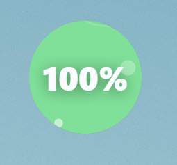
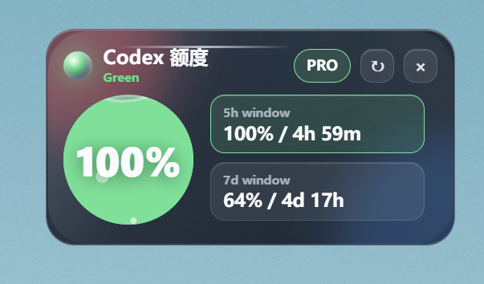

# Codex Quota Glass Widget

一个 Windows 桌面悬浮小组件，用液态玻璃风格实时显示本机 Codex 额度状态。

本项目作为 [xicunwus2025-sys/codex-led-widget](https://github.com/xicunwus2025-sys/codex-led-widget) 的分支思路继续开发：保留“桌面额度状态提示”的目标，但抛弃原仓库的界面与运行方式，改成 Electron 原生窗口和自定义液态玻璃 UI。




## 特性

- 读取本机 Codex quota 数据并显示剩余额度百分比。
- 液态球体水位显示，水位跟随实际百分比变化。
- 小球 / 中等信息面板双击切换。
- 小球模式支持拖动。
- 小球悬浮后向右展开信息胶囊，显示 `5h`、`7d` 和计划类型。
- 默认右上角显示，窗口置顶，不在任务栏显示图标。
- Windows portable exe 打包，无需安装。

## 运行

```powershell
npm install
npm start
```

## 打包

```powershell
npm run build
```

打包产物会输出到 `dist/CodexQuotaGlass.exe`。

## 额度数据

程序会从本机 Codex 相关数据中读取 quota 状态。若未检测到可用数据，界面会显示读取失败或空状态。请先确保 Codex 本身已经在本机正常登录并产生过额度信息。

## 与原项目的关系

原项目地址：[xicunwus2025-sys/codex-led-widget](https://github.com/xicunwus2025-sys/codex-led-widget)

这个仓库是基于原作者“用桌面小组件显示 Codex 额度”这个方向做的独立分支/重写版本，重点放在：

- 更稳定的本地 Electron 运行方式。
- 更接近液态玻璃的小组件视觉。
- 更小的悬浮球形态和 hover 展开信息。
- Windows portable exe 分发。

## 许可

MIT
